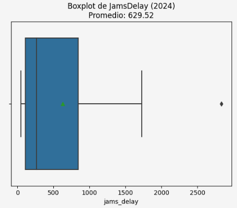
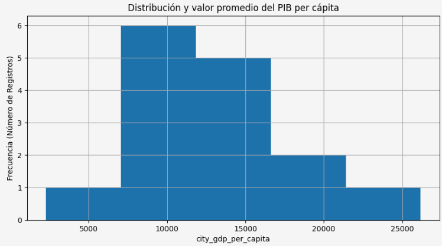
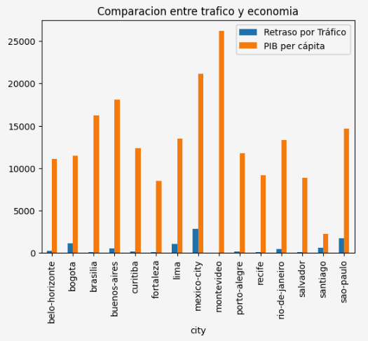

# Acerca de mí

Analista de Datos actualmente en formación con conocimientos en Excel, SQL y Python. Cuento con experiencia en soporte tecnológico, atención al cliente en inglés y coordinación de equipos remotos. Destaco por mi capacidad para analizar problemas, aprender rápidamente y trabajar de manera colaborativa, aportando soluciones prácticas en entornos tecnológicos dinámicos.

Lo que más me atrae de una posición en Análisis de Datos es la oportunidad de transformar información en soluciones que permitan comprender mejor los problemas, optimizar procesos y apoyar la toma de decisiones. 

### Hard Skills
- Excel
- SQL
- Python
- Data Cleaning
- Data Visualization
- Reporting
- Análisis Estadístico

### Soft Skills
Comunicación Efectiva | Liderazgo | Resolución de Problemas | Pensamiento Analítico | Trabajo Remoto

### Idiomas
- Español (Nativo)
- Inglés (Avanzado)

 

* * *

# Proyectos seleccionados

## Movilidad urbana y productividad económica
El equipo debe entregar un reporte para entender cómo la movilidad urbana **(niveles de congestión, tiempos de viaje, retrasos)** se relaciona con la productividad económica **(PIB per cápita, desempleo)** en las principales ciudades del mundo.

El objetivo del banco es identificar en qué ciudades invertir en infraestructura de transporte para aumentar la productividad y el bienestar de la población.

#### Herramientas y tipo de proyecto

<!-- -->
 

<!-- -->

### Preguntas del negocio:
1. ¿Qué ciudades presentan alta congestión y baja productividad económica?
2. ¿Cuáles muestran los mejores indicadores combinados (movilidad eficiente y economía fuerte)?
3. ¿Qué variables parecen tener una relación más fuerte con el desarrollo urbano?

### Metodologia y analisis sobre el impacto del trafico directamente sobre el PIB de las ciudades en latinoamerica (2024)
### Calidad de datos:

- Se normalizo el titulo de todas las comunas a snake_case.
- Ambos datasets presentan anomalias en la estructura de sus respectivas columnas, se implemento formatos y estandarizacion para garantizar la integridad y trazabiliad de los datos de acuerdo a el diccionario.
- Se reemplazaron simbolos "," y o "." mediante tipo texto para posteriormente convertirlos a float y poder usarlos en calculos.
- Cambio de fecha a datetime para posteriormente extraer el ano a una nueva columna `year` y poder filtrar los datasets.
- Se utilizo INNER join para combinar 2 datasets `eco` y `traffic` ambos datasets mediante `year` y `city` como claves.

### Cobertura:

- Se filtro para analizar datos con respecto al periodo del 2024.
- Cabe destacar que el dataset "eco" contenia unicamente informacion de paises de LATAM lo cual redujo considerablemente el volumen de datos ya que se uso INNER JOIN.
- Al final quedaron un total de 7 paises: 'Argentina' 'Brazil' 'Chile' 'Colombia' 'Mexico' 'Peru' 'Uruguay. Con sus respectivas ciudades:(15 en total).
- Relación entre la movilidad urbana (congestión, tiempos de viaje) y la productividad económica (PIB per cápita).

## Visualización y análisis de relaciones

### Visualizar relaciones entre economía y tráfico

1.- **Boxplot para observar el comportamiento de los minutos de congestion JamsDelay:** Se uso para observar la media, mediana y detectar valores atípicos.

2.- **Histograma para ver la distribución de la economía `(city_gdp_capita)`:** Se ulitizo para para analizar la forma de la distribución y el valor promedio del PIB per cápita.

3.- **Gráfico de barras para comparar `jams_delay` y `city_gdp_capita` por ciudad:** Finalmente, comparamos ambas variables, para observar si existe alguna relación entre ellas, haciendo un solo gráfico de barras donde aparezcan ambos indicadores.

### Conclusiones:

- La mayoria de los paises presentan una relacion consistente entre el trafico y el PIB.
- Existen casos atipicos como lo es la Ciudad de México (CDMX): Es el caso más crítico; presenta el mayor retraso por tráfico de la muestra y el segundo PIB per cápita más alto, lo que evidencia un problema severo de congestión frente a su poder económico.
- Montevideo: Registra, por amplio margen, el mayor PIB per cápita, pero mantiene niveles de tráfico prácticamente imperceptibles, sugiriendo una movilidad eficiente.
- Santiago: Muestra un comportamiento atípico al registrar el PIB per cápita más bajo de todo el gráfico, pero con un nivel de tráfico visiblemente superior al de economías más grandes como Buenos Aires o Brasilia.
- Tendencia en Brasil: Ciudades como Sao Paulo y Brasilia lideran el bloque económico brasileño con tráfico moderado, mientras que Fortaleza y Salvador se quedan rezagadas en ambas métricas.

### Recomendaciones:

- Priorizar Infraestructura de Movilidad en Nodos Críticos (Caso CDMX) Canalizar inversión pública y privada hacia sistemas de transporte masivo de alta capacidad (metros, trenes suburbanos) y optimización de redes viales. Ciudad de México es un motor económico clave (segundo PIB más alto), pero la severa congestión vehicular actúa como un impuesto invisible que reduce la productividad, destruye horas-hombre y frena un potencial de crecimiento aún mayor.

- Auditoría y Corrección de Datos Socioeconómicos (Caso Santiago) Solicitar una revisión técnica urgente de la metodología de captura de datos para la métrica del PIB en el cono sur. Los datos muestran a Santiago con el PIB per cápita más bajo de la muestra, lo cual contradice abiertamente los indicadores macroeconómicos reales de la región. Antes de usar este reporte para decisiones financieras, se debe descartar un error de normalización o de divisas.

- Modelado de Buenas Prácticas (Caso Montevideo) Realizar un estudio de referencia (benchmarking) detallado sobre las políticas de desarrollo urbano, densidad poblacional y transporte de Montevideo. Al ser la ciudad con el mayor PIB per cápita pero con un impacto de tráfico mínimo, representa el escenario ideal de eficiencia. Es necesario entender si este éxito se debe a una planificación urbana replicable o simplemente a su escala demográfica.

- Estrategia de Conectividad Descentralizada para Brasil. Implementar incentivos de descentralización comercial (como el trabajo remoto o parques industriales periféricos) en los centros de alto PIB como Sao Paulo. El bloque brasileño muestra una disparidad muy marcada; mientras los grandes centros económicos sufren de tráfico perceptible, las regiones del noreste (Fortaleza, Salvador) se quedan rezagadas en economía. Descentralizar aliviaría la presión vial de los motores económicos del país.

<!--!**Explora más detalles del proyecto en el [repositorio completo](https:).** -->

